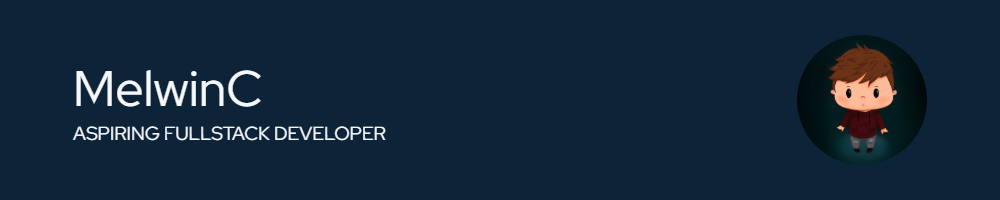

 

## Who am I

 

  

I'm Melwin, a french 24 years old junior full-stack developer.   Currently studying for my bachelor's degree.   Check my portfolio [here](https://melwinchenu.fr)

## Hard skills

#### Programming languages

    
    
    

#### Frameworks

    
    
    

#### Database

    
    
    

#### DevOps / Collaboration

    
    
    
    

## Some stats

 

